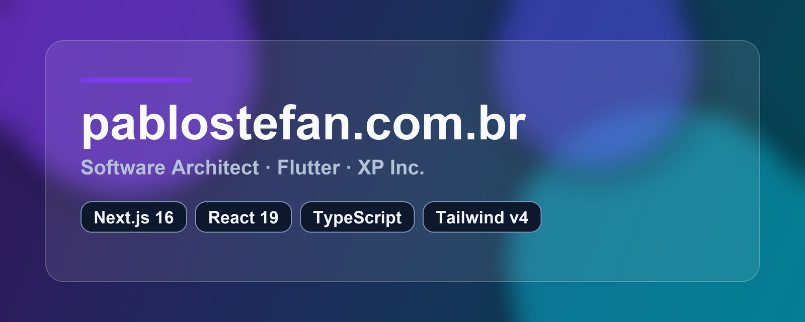

# pablostefan.com.br

Personal portfolio — Software Architect · Flutter · XP Inc.

[](https://pablostefan.com.br)

[](https://pablostefan.com.br)


---

## Overview

Self-updating personal portfolio built with **Next.js 16 App Router**, featuring:

- **Glassmorphism** premium dark design
- **Bilingual** PT/EN via `next-intl`
- **Auto-updating** data from GitHub API (ISR) and LinkedIn profile export
- **Certifications** fetched from Credly
- Fully **accessible** (WCAG 2.1 AA) and **responsive**

## Stack

| Layer | Technology |
|---|---|
| Framework | Next.js 16.2 (App Router, Turbopack) |
| Language | TypeScript 5 |
| Styles | Tailwind CSS 4 (CSS `@theme` tokens) |
| Animations | Framer Motion 12 |
| i18n | next-intl 4 |
| Icons | lucide-react |
| Fonts | Space Grotesk · Inter · JetBrains Mono |
| Deploy | Vercel |

## Getting Started

```bash
# Install dependencies
npm install

# Copy env file and fill in your tokens
cp .env.example .env.local

# Start dev server
npm run dev
```

Open [http://localhost:3000](http://localhost:3000).

### Environment Variables

```env
# GitHub — increases rate limit (github.com/settings/tokens)
GITHUB_TOKEN=ghp_xxxxx

# LinkedIn — server-side only, never expose to client
LINKEDIN_ACCESS_TOKEN=AQV...

# App URL for Open Graph
NEXT_PUBLIC_APP_URL=https://pablostefan.com.br
```

## Project Structure

```
app/
├── [locale]/          # PT | EN routes
│   ├── layout.tsx
│   └── page.tsx
├── api/
│   ├── github/        # ISR — GitHub repos
│   └── linkedin/      # LinkedIn headline + photo
├── icon.tsx           # PNG favicon (32×32)
└── apple-icon.tsx     # Apple touch icon (180×180)

components/
├── layout/            # Navbar · Footer
├── sections/          # Hero · About · Experience · Projects · Certifications · Contact
└── ui/                # GlassCard · GradientText · AnimatedBlob · TypewriterText · SkillBadge …

data/
├── profile.json       # About + Experience (bilingual, manual/auto-updated)
└── certifications.json

messages/
├── pt.json
└── en.json

scripts/
├── parse-linkedin-pdf.js    # Parses LinkedIn PDF export → profile.json
├── enhance-profile-ai.js    # AI-polishes profile text
└── parse-cert-pdfs.js       # Parses certification PDFs → certifications.json
```

## Updating Profile Data

```bash
# Full update (LinkedIn PDF → profile.json → AI polish)
npm run update-profile

# Steps individually
npm run update-profile:pdf   # parse LinkedIn export PDF
npm run update-profile:ai    # polish text with AI

# Update certifications from PDFs in uploads/certs/
npm run update-certs
```

Place your LinkedIn Data Export PDF in `uploads/linkedin/` before running.

## Scripts

| Command | Description |
|---|---|
| `npm run dev` | Dev server with Turbopack |
| `npm run build` | Production build |
| `npm run start` | Start production server |
| `npx tsc --noEmit` | Type-check |
| `npm run lint` | Lint |

## Design System

The design is built on a **Glassmorphism** dark theme with a custom Tailwind CSS 4 `@theme` token set:

| Token | Value |
|---|---|
| `--color-bg-base` | `#030712` |
| `--color-accent` | `#7C3AED` (violet) |
| `--color-accent-cyan` | `#06B6D4` (cyan) |
| `--color-glass-bg` | `rgba(255,255,255,0.04)` |
| `--shadow-glow-violet` | `0 8px 40px rgba(124,58,237,0.22)` |

## Deployment

The project auto-deploys to Vercel on every push to `main` via GitHub Actions.

```bash
# Manual deploy
vercel --prod
```

## License

MIT — feel free to use this as a base for your own portfolio.

---

<div align="center">
  Made by <a href="https://pablostefan.com.br">Pablo Stefan</a> · <a href="https://linkedin.com/in/pablosgpereira">LinkedIn</a> · <a href="https://medium.com/@pablo.stefan">Medium</a>
</div>
